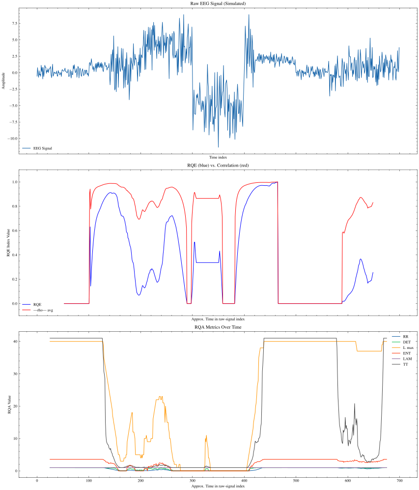

# Report week 1

## Project summary

This project focuses on the classification of electroencephalograms (EEG) from healthy children (CN) versus children with Developmental Dyslexia (DD). The patients are exposed to a prolonged white noise stimulus at specific frequencies (4 Hz, 16 Hz, and 40 Hz) for 2.5 minutes each, in both ascending and descending order, with each test lasting a total of 2.5 × 6 minutes. During this period, brain activity is recorded using a 32-channel EEG (31 + control). The study aims to analyze a specific frequency band from each EEG channel, either the theta or gamma band.

To properly interpret the results of the proposed methodology in the context of DD, the Temporal Sampling Framework (TSF) will be applied. This theory suggests that changes in temporal sampling at slow time scales in an auditory signal can lead to difficulties in language and music development. These changes may be linked to differences in how auditory information is received, potentially arising from variations in the ability to distinguish sound variations and the information perceived about them. TSF posits that atypical oscillatory sampling at different temporal rhythms may be the cause of phonological impairments in DD.

It is hypothesized that a healthy brain will adapt to the stimulus, causing brain activity in regions associated with phonetic aspects of speech to adjust to the stimulus, thereby attenuating the signal recorded by the electrode.

To characterize the temporal windows based on the chosen exposure frequency, Recurrence Quantification Analysis (RQA) from chaos theory will be employed. The approach involves taking the EEG signal from a specific channel and a selected frequency band (theta or gamma) and transforming the original time series using a chaotic parameter (RQE) that more effectively highlights changes in signal descriptors (mean, variance, etc.). Samples where this change is detected will correspond to brains exhibiting attractors in phase space (healthy), while samples without significant changes will correspond to more deterministic subjects, possibly those with DD.

## Findings

- We were able to generate a synthetic signal similar to the paper's

- We were able to perfrom a simple visualization of a RQA matrix

- It seems like the RQE parameters explosed in the paper dont yield the same results for our test signal. This may be due to a post-processing of the data or the adding of a small numeric stabilization constant to the spearman correlations computed.


## Outcomes (RQE)

As observed in the preceding figures, the input synthetic signal was generated to closely approximate the temporal parameters of mean and standard deviation specified in the literature. A standard recurrence plot visualization confirmed the presence of temporal dynamics extending beyond the main diagonal line, validating the appropriateness of applying Recurrence Quantification Epoch (RQE) analysis to this signal. The RQE methodology employs a two-stage window approach for analysis:

The first sliding window of size \(E\) (epoch size) processes the raw input signal \(X = \{x_1, x_2, ..., x_N\}\) and computes a set of Recurrence Quantification Analysis (RQA) metrics for each window position. This transformation yields a matrix \(R\) of dimensions \((N-E+1) \times M\), where \(M\) represents the number of RQA metrics extracted.

Mathematically, for each window starting at position \(i\):

\[R_{i,j} = \text{RQA}_j(X_{i:i+E-1})\]

Where \(\text{RQA}_j\) represents the \(j\)-th RQA metric function (e.g., RR, DET, L_max) applied to the signal subset.

For example, with \(E=50\) and \(M=6\) metrics, the resulting matrix would have the form:

```
R = [
    [RR₁, DET₁, L_max₁, ENT₁, LAM₁, TT₁],
    [RR₂, DET₂, L_max₂, ENT₂, LAM₂, TT₂],
    ⋮
    [RR_{N-E+1}, DET_{N-E+1}, L_max_{N-E+1}, ENT_{N-E+1}, LAM_{N-E+1}, TT_{N-E+1}]
]
```

Lenta: proxoria 
Media: silábica 
Rápida: fonema (40)

The second window of size \(B\) (big window size) operates on the RQA metrics matrix \(R\). For each position of this window, Spearman rank correlations (\(\rho\)) are computed between all pairs of RQA metrics within the window.

For a window starting at position \(k\), the RQE value is calculated as:

\[\text{RQE}_k = \prod_{j=1}^{M}\prod_{l=j+1}^{M} (1 + |\rho(R_{k:k+B-1,j}, R_{k:k+B-1,l})|)\]

Where \(\rho(R_{k:k+B-1,j}, R_{k:k+B-1,l})\) is the Spearman correlation between the \(j\)-th and \(l\)-th RQA metrics over the window spanning positions \(k\) to \(k+B-1\).


The RQE index quantifies the temporal coherence among different RQA metrics, serving as an indicator of changes in dynamical complexity within the signal. Higher RQE values suggest stronger correlations among RQA metrics, potentially indicating more organized or structured dynamics within that temporal segment. Conversely, lower RQE values may signify more independent behavior among RQA metrics, possibly reflecting increased complexity or transitional dynamics.

The metric transforms a time series into a measure that captures the evolution of complex dynamics across time, offering insights into temporal patterns of recurrence behavior that might not be apparent from direct signal analysis.

## Objectives for this week

- [X] Analyze RQA paper [Orlando, G., & Zimatore, G. (2018). RQA correlations on real business cycles time series. SSRN.](https://d1wqtxts1xzle7.cloudfront.net/70687546/0035-0041-libre.pdf?1636043587=&response-content-disposition=inline%3B+filename%3DRQA_correlations_on_real_business_cycles.pdf&Expires=1741034001&Signature=JjT~qvESm9uqVV2j-EEMqEvIa~wGZxN71NPq8laB2uUZUGfJdjj~J7XsR5j2MVdeDRaDCbaLZ3YUS~2TzKEFreurwGI2H~fdaqpPO-6g~m47ggITqVO~L-v1toLR4BHeZbi0vWskVRvO8yH1hAJn~XtmPsGZhDu5HqYMWxAB6ynScWboyLoZVS5PZU8yPYPXTx45m9r5Kvm7sjf95YqIvckKu0Cj9rIUIt5ggSuUcXgzSdTji-osrHnJ-pE7IkTEAg~UuHhsNEYN8eqwwsNJ3eotpjbl-oozxY7lL6GuNFBJhysXz7nxxytf1iXKgRXnbnsjRNjvBXoiEa8hBSKAnQ__&Key-Pair-Id=APKAJLOHF5GGSLRBV4ZA):
  - [X] Generate artifical data to simulate a signal whose mean and variance change in time: \(\phi(t) \space / \space \mu_{\phi}(t), \space \sigma_{\phi}(t)\).
  - [X] Code the RQE metric to get a similar result as the paper
- [X] Write a summary about the workflow intended for the project.

## Weekly Project Time Tracking

| End Date       | Task Description            | Hours Spent | Category/Type | Notes |
|------------|----------------------------|------------|--------------|-------|
| 2025-03-03 | First meeting with Ignacio      | 2.5        | Meetings | The basis of the project where settled, including the input data and methodology |
| 2025-03-03 | Bibliography review             | 1.5        | Research              |       |
| 2025-03-07 | Signal generator and RQE metric | 14.0        | Research/Code              |       |
