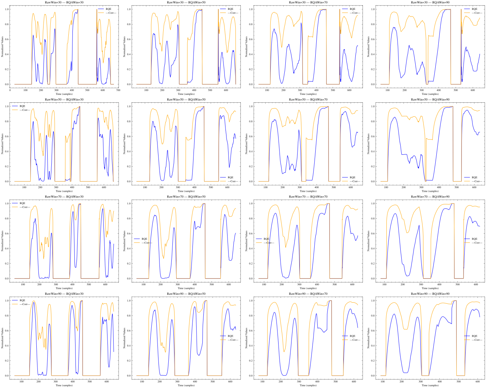

# Report week 1

## Progress Report

### Sliding window size

Observing the figure, we may conclude that a wider context window in the temporal space could help the model gather more data from the time series signal, but, in the RQ space, using a smaller window may allow us to capture the correlation differences between the analyzed metrics in the RQ space, allowing us to better quantify the changes in the temporal domain.

On the other hand, a smaller context window in the temporal domain could bias the RQ metrics to quantify noise rather than important changes.

## Objectives for this week

- [ ] EEG data
  - [X] Parallelize the preprocessing code (**Dask!!**)
  - [ ] Make a script to extract the data that we want to treat with (frequency, electrode, bandwidth decomposition)

-  [ ] RQE
  - [ ] Apply RQE metric to input data and visualize before and after on a set of patients.
  - [X] Analyze the inpact of different window sizes for RQE algorithm

## Weekly Project Time Tracking

| End Date       | Task Description            | Hours Spent | Category/Type | Notes |
|------------|----------------------------|------------|--------------|-------|
| 2025-13-03 | Meeting with Ignacio      | 1.0        | Meetings | EEG database was explained |
| 2025-13-03 | Sliding window analysis      | 2.0        | Code/Research |  |
| 2025-13-03 | EEG Preprocessing parallelization      | 1.0        | Code |  |