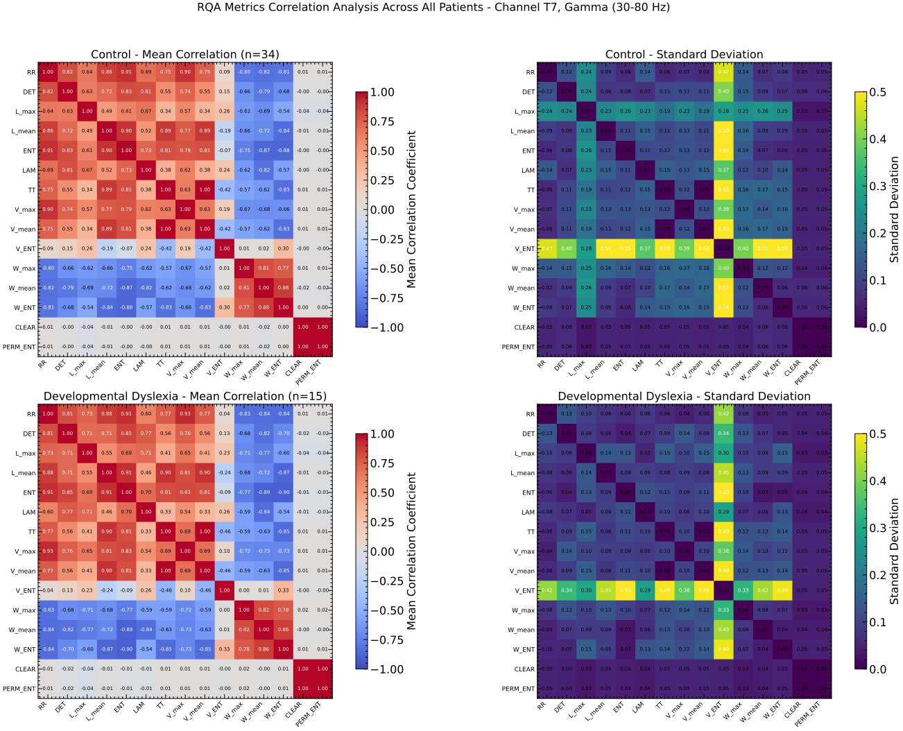
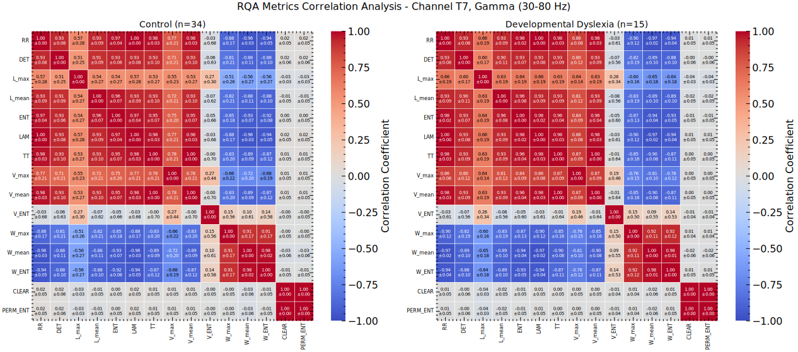
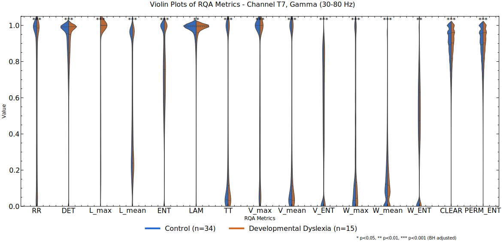

# Report week 2-3

## Progress Report

### Sliding window size

Observing the figure, we may conclude that a wider context window in the temporal space could help the model gather more data from the time series signal, but, in the RQ space, using a smaller window may allow us to capture the correlation differences between the analyzed metrics in the RQ space, allowing us to better quantify the changes in the temporal domain.

On the other hand, a smaller context window in the temporal domain could bias the RQ metrics to quantify noise rather than important changes.

### Window size exploration

The main objective of this week was to explore the sizes of the temporal-domain window and RQ-domain window need to capture enough variability. After visualizing the effects on the final RQE and rho-abs correlation, these are the main findings:

1. The approximate temporal window size needed to capture enough variability to make the RQA metrics vary is **100ms**.
2. The paper uses a stride of 1 when moving the window in the temporal domain, but we should move the window with a higher stride in order to capture the events more clearly. Using a lower stride can cause the metrics to be too similar, leading to a null RQE correlation. The approximate stride needed is in the 5-10 range, `stride=7` was used.
3. There are some RQ variables that do not really change despite of the window sizes. We are going to compute all the metrics for all channels and patients, but we must apply a filter to these metrics:
   1. **Remove highly-correlated metrics**. Highly correlated RQ metrics may introduce a bias in the spearman correlation compute.
   2. **Remove metrics with low std**. If a metrics has low standard deviation, we can assume that it does not change, therefore, adding only noise to the RQE computation.

In this figure we can observe the different steps performed on a 200ms time window of a Gamma bandwidth signal of a DD patient to compute the RQE values. As the window size and stride increases we can compute less and less RQE points. Some metrics remain the same, while others seem to vary a lot more depending on the window. These are the RQA matrix per window:

Using a time-domain window size of 100ms, a stride of 7, and a RQ-domain window size of 25 metrics, removing metrics that did not seem to vary over time, we could apply this processing to a full-length electrode channel for the Gamma bandwith of patient 0 for DD and CT:

Finally, a small exploration of the RQA matrix and metrics on other bandwidths for a 100ms window was explored.

As seen, Delta and Gamma bandwidths are the ones that seem to have high distinct recurrence amongst all bandwidths.

## Correlation exploration

The RQE metric is composed by the Spearman correlation of windows inside the recurrence matrix. The correlation between the RQA metrics is important to understand the final RQE value. This is why we have proceeded with a feature selection before proceeding with the RQE metric computing. Using a time-domain window of 100ms, we have computed the RQA metrics for all patients, for channel T7, suspected to be relevant to the analysis as stated by the double route model of David Poeppel.

Computing the Spearman correlation between variables for each patients and then proceeding to show the mean and standard deviation by groups, we obtain the following figures:

We can observe that there are some highly correlated metrics, such as CLEAR (Complexity Entropy) and PERM_ENT (permutation entropy), which are not correlated to the other metrics, therefore, one on them must be removed, but not both, since they seem to be relevant to the RQA analysis. Another set of metrics that are highly correlated are TT (Trapping Time) and V_mean (Mean of the diagonal line lengths).
The set of W_* variables (W_max, W_mean, and W_ent) seem to be inversely correlated to the rest of the metrics, while being correlated to each other.

Now that we know which metrics we should remove, we can proceed to compute how similar these metrics are between DD and CT patients. This is important to notify if any metrics could be a good candidate to differentiate between DD and CT patients, forcing us to use that metric in the RQE computation.

We have taken three approached to quantify this:

- Compute the p-value with a Mann–Whitney U test (since the normality of the data is questionable), which was corrected using the Benjamini–Hochberg correction (False Discovery Rate, FDR). Small values suggest a statistically significant difference between the two groups (DD vs. CT).
- Compute the Cohen's d effect size to quantify the difference between the groups. This is a measure of how many standard deviations the means are apart. Large values suggest a large difference between the groups.
- Compute the Jensen-Shannon divergence to get a distance metric that quantified the difference between the Probability Density Functions (PDF) of each metrics across groups.

| Metric     | p_value                | p_adjusted           | effect_size           | js_divergence         |
|-----------|------------------------|----------------------|----------------------|----------------------|
| RR        | 9.3409e-185            | 2.8023e-184         | -0.05243             | 0.05294              |
| DET       | 8.19997e-05            | 9.46151e-05         | 0.00716              | 0.08186              |
| **L_max**     | **0.0**                    | **0.0**                 | **-0.09359**             | **0.45851**              |
| L_mean    | 1.24425e-52            | 2.07374e-52         | -0.02774             | 0.07897              |
| ENT       | 3.69689e-11            | 4.62111e-11         | 0.01197              | 0.08697              |
| LAM       | 0.00165                | 0.00177             | 0.00569              | 0.09469              |
| TT        | 9.45431e-177           | 1.77268e-176        | -0.05127             | 0.04611              |
| V_max     | 8.30669e-184           | 2.07667e-183        | -0.04968             | 0.06416              |
| V_mean    | 9.45431e-177           | 1.77268e-176        | -0.05127             | 0.04611              |
| V_ENT     | 2.32015e-46            | 3.48023e-46         | 0.02595              | 0.05791              |
| W_max     | 3.58059e-193           | 1.34272e-192        | 0.05361              | 0.05311              |
| W_mean    | 2.61387e-18            | 3.56437e-18         | -0.01579             | 0.07430              |
| W_ENT     | 0.00752                | 0.00752             | 0.00483              | 0.06844              |
| CLEAR     | 8.70786e-200           | 6.53089e-199        | 0.05472              | 0.04624              |
| PERM_ENT  | 9.81636e-198           | 4.90818e-197        | 0.05444              | 0.04623              |

While all the p-values shown high significance, the effect size of the metrics was very low, suggesting that the difference between the groups is not that big. This is further supported by the Jensen-Shannon divergence, which shows that the PDF of the metrics across groups are very similar.

However, the metrics that stands out the most is L_max, which has a large effect size and a large Jensen-Shannon divergence, suggesting that this metric could be a good candidate to differentiate between DD and CT patients. This metric should be included in the RQE computation.

## Objectives for this week

- [X] RQE
  - [X] Apply RQE metric to input data and visualize before and after on a set of patients.
  - [X] Analyze the inpact of different window sizes for RQE algorithm
  - [X] Parallelize the RQA metrics and RQE metrics computing on Picasso
  - [X] Analyze correlations between RQA variables in order to clean up for RQE computation

## Weekly Project Time Tracking

| End Date       | Task Description            | Hours Spent | Category/Type | Notes |
|------------|----------------------------|------------|--------------|-------|
| 2025-13-03 | Meeting with Ignacio      | 1.0        | Meetings | EEG database was explained |
| 2025-13-03 | Sliding window analysis      | 2.0        | Code/Research |  |
| 2025-13-03 | Zerolag EEG Preprocessing parallelization      | 1.0        | Code |  |
| 2025-17-03 | RQE EEG Preprocessing parallelization      | 16.0        | Research/Code | The window size effect on final data was explored |
| 2025-19-03 | Correlation analysis      | 12.0        | Research/Code |  |
