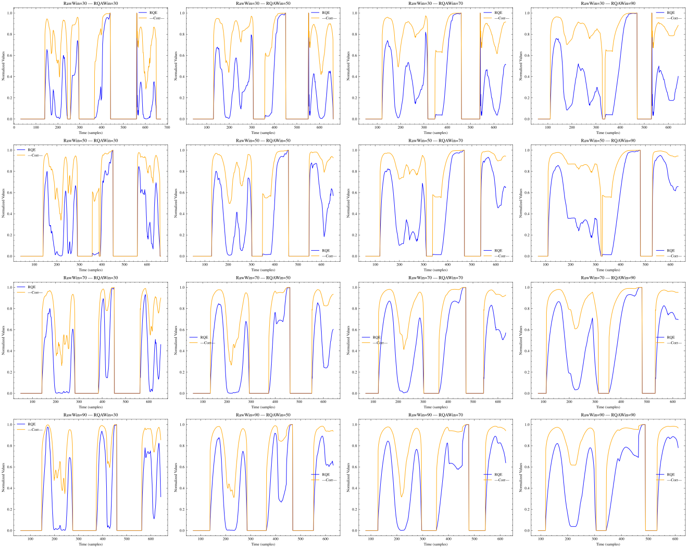

# Report week 2-3

## Progress Report

### Sliding window size

Observing the figure, we may conclude that a wider context window in the temporal space could help the model gather more data from the time series signal, but, in the RQ space, using a smaller window may allow us to capture the correlation differences between the analyzed metrics in the RQ space, allowing us to better quantify the changes in the temporal domain.

On the other hand, a smaller context window in the temporal domain could bias the RQ metrics to quantify noise rather than important changes.

### Window size exploration

The main objective of this week was to explore the sizes of the temporal-domain window and RQ-domain window need to capture enough variability. After visualizing the effects on the final RQE and rho-abs correlation, these are the main findings:

1. The approximate temporal window size needed to capture enough variability to make the RQA metrics vary is **100ms**.
2. The paper uses a stride of 1 when moving the window in the temporal domain, but we should move the window with a higher stride in order to capture the events more clearly. Using a lower stride can cause the metrics to be too similar, leading to a null RQE correlation. The approximate stride needed is in the 5-10 range, `stride=7` was used.
3. There are some RQ variables that do not really change despite of the window sizes. We are going to compute all the metrics for all channels and patients, but we must apply a filter to these metrics:
   1. **Remove highly-correlated metrics**. Highly correlated RQ metrics may introduce a bias in the spearman correlation compute.
   2. **Remove metrics with low std**. If a metrics has low standard deviation, we can assume that it does not change, therefore, adding only noise to the RQE computation.

In this figure we can observe the different steps performed on a 200ms time window of a Gamma bandwidth signal of a DD patient to compute the RQE values. As the window size and stride increases we can compute less and less RQE points. Some metrics remain the same, while others seem to vary a lot more depending on the window. These are the RQA matrix per window:

Using a time-domain window size of 100ms, a stride of 7, and a RQ-domain window size of 25 metrics, removing metrics that did not seem to vary over time, we could apply this processing to a full-length electrode channel for the Gamma bandwith of patient 0 for DD and CT:

Finally, a small exploration of the RQA matrix and metrics on other bandwidths for a 100ms window was explored.

As seen, Delta and Gamma bandwidths are the ones that seem to have high distinct recurrence amongst all bandwidths.

## Correlation exploration

## Objectives for this week

- [X] RQE
  - [X] Apply RQE metric to input data and visualize before and after on a set of patients.
  - [X] Analyze the inpact of different window sizes for RQE algorithm
  - [X] Parallelize the RQA metrics and RQE metrics computing on Picasso
  - [X] Analyze correlations between RQA variables in order to clean up for RQE computation

## Weekly Project Time Tracking

| End Date       | Task Description            | Hours Spent | Category/Type | Notes |
|------------|----------------------------|------------|--------------|-------|
| 2025-13-03 | Meeting with Ignacio      | 1.0        | Meetings | EEG database was explained |
| 2025-13-03 | Sliding window analysis      | 2.0        | Code/Research |  |
| 2025-13-03 | Zerolag EEG Preprocessing parallelization      | 1.0        | Code |  |
| 2025-17-03 | RQE EEG Preprocessing parallelization      | 16.0        | Research/Code | The window size effect on final data was explored |
| 2025-19-03 | Correlation analysis      | 8.0        | Research/Code |  |
